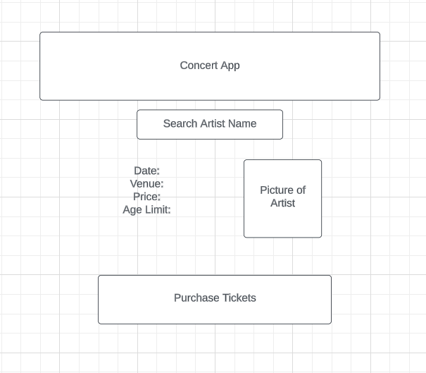

<div id="top"></div>
<!--
*** Thanks for checking out the Best-README-Template. If you have a suggestion
*** that would make this better, please fork the repo and create a pull request
*** or simply open an issue with the tag "enhancement".
*** Don't forget to give the project a star!
*** Thanks again! Now go create something AMAZING! :D
-->


<!-- PROJECT SHIELDS -->
<!--
*** I'm using markdown "reference style" links for readability.
*** Reference links are enclosed in brackets [ ] instead of parentheses ( ).
*** See the bottom of this document for the declaration of the reference variables
*** for contributors-url, forks-url, etc. This is an optional, concise syntax you may use.
*** https://www.markdownguide.org/basic-syntax/#reference-style-links
-->


<!-- PROJECT LOGO -->
<br />
<div align="center">
  <a href="https://https://github.com/jliakim23/Project_1">
    <img src="data:image/jpeg;base64,/9j/4AAQSkZJRgABAQAAAQABAAD/2wCEAAoHCBUWFRgVFRUYGBgaGBgZGBgYGRgYGBgYGBgaGhgYGhgcIS4lHB4rHxgZJjgmKy8xNTU1GiQ7QDs0Py40NTEBDAwMEA8QHhISGjEhISs0NDQ0NDQ0NDQ0NDQ0MTQ0NDQ0MTQ0NDQ0NDQ0NDQ0NDQ0NDQ0NDQ0NDQ0NDQ0NDQ0NP/AABEIAMIBAwMBIgACEQEDEQH/xAAcAAACAwEBAQEAAAAAAAAAAAAAAwIEBQYBBwj/xAA6EAACAgEDAgMGBAQFBAMAAAABAgARAwQSITFBBVFhBhMicYGRobHR8BQyQsEHUmKS4RYjcvEVgqL/xAAZAQADAQEBAAAAAAAAAAAAAAAAAQIDBAX/xAAgEQEBAQEAAgMBAQEBAAAAAAAAAQIREiEDMUFRYRMy/9oADAMBAAIRAxEAPwD5SsmsiIxRN4tJRGKJFRGqJUNJRGqsiqx6LLgeIkfjSCJLeFJUgSw4blldL6R+mxTY0uluXMdLrD/g/SRfS+k7HH4ZY6ReTwm+0jU40z7cd/Dzz3U7FvZ8DGXdtvxBVFH4ievPoOZR8Z8GGLaytvR72HoxC0CSvYX0mcst4vxsc37qNTDLi6c/5ZN9Oy9RVehl+IisuCXNNprMngxEzQ0+EiqHz6n8pOovLd8A8CxZDTixzx07Sr4j7KY1yMHyBECFgT+AF9TLOg1ezvUp+0+s9+wIG0BQPMmu5M5/G+Sr3v8Ajg8+Kj2qVnx97nRHRCun6ytk0nUc/XkzbrG5YqYiYz3M0cOkIFkUZMYPSTqlxkNgimwzoH0tjgV8pXfR+kz6LGE+KKfHNl9MekrZMERVkukrOk1MmOU8qSLU8Z7rFsstOsS4gRFQk6hAjFjkEUsek6YE0Ecgi0EaglQzUEcgi1EekqA1Fl7Asp45axNLyGtpVnReG4wanN6VpvaHPU3l9Jsd14boVYSv4pgVG4mXpvGyg6yjr/FS55M5tY1de76PEvTPFtcXQYxQUHd63VTBOnLNybEc2W43BHnMy6fszQYArBto4N8jyl3xh2zklqutooAcc/frGaXFc1F8MYi9pi1rPfZWT7clptIVBsd5b2cUB85s5NAVNEQ/+PNS+5sRd8rEZJNNLf75l9tL5y5pMQBmO7xpnfWa3hfHSZeo8PonifSMOmUrzXz8pn6/wzGFZr57Dz5mHn7L/pL6cAdLxIppLPSbh03NSeHR89Jpo5xR03h27tNTH7NFhwJq6LSzb0orgd5z37K65PT5rqvBCLFTF1vhhHafZD4eh6jv95he0nhiBbEffTK6lvp8c1GmqZepx1Ou8R09EzB1KSLT4wnSV3WaeZJQ1A5i6mqtQkoRkksesSojlnZIRqRyCLWOSVIo1BHrEJHqZQNWPQyusckA0dO80sOeY2Iyyjy5ocax1Eh725SXJJh4/JcXEeXtO8ylaWUeTauV0mizidHo9YoHxNVfX8Jw2HPU0NPnszHWZTvt1isczbrpQaH19JoIiAc1MbBqQF/H6ynqdafOR9+vpjr47+J65huNRWJpVOa4zG8eq0znkbuhycizxK3iR3Nx07fIRWHNQjN1zHP/AKGpz2r4NL6S3j0dG6lzQ4wZoZMYAl60x8r1n4MUv4hUrKRLSZFHeZHq3gyZPKY3iunZlJPSaGbOLuZ/i3iajG3nxQ/uZjrfP1eMXs5HC+N+HMg3FSAehrgzjNYJ1/tF49kzDYW+EdAAAPwnGapoeS7mz7ZueUNT1+gl7NKOVev746QlZ2KsJ7CUhNY1YpY1Z6HCOSOSJSOSPhnJHLFJHKI+GYsesSkcsOA5TGoYlY1YzPQxoMSsYkXTWFMehlcR2OLqllGlzTvUpJLSLM9aXGxj1XwxeTNcRgMCOZlbz2o1Hl/QoLtug7efpKWJJexzLWrVSHb+TQodh5cxqPJJhBG6gBwoA7+Zl041VeelA0K5NHqesXlxFnUMWqqWDqie8xPeyYzdorsv+XtpnUxWXWROnUEEmyaNAefYmVNaVUhQbIHxH18h8phrd/GufjneU3PrqnOeKawtfMdrc5uVdNhDNbC1HJHmewmF++10SeuRQHg2bKu9V3W21VB+ImrJrsoHczl9XjIJB7cT6Jq9YceEopqwLI68dr+s4fJgLGX8WrWPy58WDlQ+UpuvNfMfpOg12QIhRLG4U7DqwsHb8rANegmBk718xN3JVPbCNZB2hGglI5YpBHKJ6kiTUj0ikEeglSGakcsWixyCHDTQRyiLWMWAMWNWLURqCTQaBG4hIoss4scm1UFR2NJJccvaXBcmgrFjlpEmlh0IAvvPc2l2n5zLS5pURY8Y47Fp7l1NNMrVeSriQy3hxWY9UjsaSOH5Ju9bVHQSHiObgD0gyc3Fa0SbO9OWSxlWbjsBJMkuKPRKmWms1FguES+8w9Rl5JlzW5CeJQfHYmWr74vPqdUHazGh9qmpEpUVmehJ51pNcU9XqC3BmXqMlDiXNU4mVnNzXE5HN8mvKs7U82TMrIs2siyjmWXK59RmQj2SErqeKaLHosgglhFnryIeoI5JFVjlWUHqCOUyKrGqkQerH44tVj8aSaE0EeiSKLLCCTQbjWXMaSvgSaOBJNU9xYptaLS8SvpMNkToNLhoSaLeI48NCenDcvpilTw3X4M5b3OVMmxtrbGDUaB7dRz1HHUdQZlU+QTSSwMEvpjkjhmdg8meuKNGOWvdzzZFxXkqNjic2CaQxwfFFw/JinHPX6TUbSiIyaWY6y1zph5F5iyk1sullLKtTDxbTTPzYBRmFq50ed+KnP6lOY5BrTJzCU8izUyY5UyYZcZ1l5BKOoWbL6cylqNOYvIrlj1CWWxwldZ8rORY9BK26lJ8gTK6+ImxQHQX8+/7/wDU9nW5n7Y9a6xqiVdDn3i6rmiPWWVfgkc1d1zyOo+cc1LOwzkEegmN4d4jZKsbaxtofzWaNenf6zZUyZqanYOmKssIsrq0so8LQcqxqLOf0/iRbVMgYlQu0LVfEKLm67U3z4nR43keXRD8U5HX+2OdcrriKhAxC2oJocXfzFzofFvEBgxM/G7oo82PTjy7n0BnGez3gj6vKQSVS7d68+aA6Fj+Ey1q95C1fx3f+G3jeo1OXKuWnUKrBgFXa17QtAc7hZ9NnrPqWnScz7O+DYdMm3CoW9u5uruRdF279Tx0Fmp1GmyqALYDgnkgcDqfpH+Fep67Hl91k9zt97sf3e7+XftOy/S6n5i0ufJjbcjvjcWCyMyODfItaI57T9V6HKmRFdGV1YWrKQysPMEdZ8E/xZ8NXF4jk2gKMuNcoCihubcjH5lkJPqTMtUo+yexGbLl0Omy5mLZHTczEAFgWOwkDj+XbNnV5kxrudgq7kWzdbncIg482YD6w8Kr3OLaAB7tKA4AG0UAOwnJ/wCLOpypoCcYFHJi3NfOPbkV1YA8N8aqK/1X2iJ0/h+rTPjXLjNo4sEgg9SOQenII+kf7uc7/hzonx6DD70EOygkHghANuIUf5f+2qEjzLHqTOpKxH0pUkikmJ7UODqAQRZUEbu1XG5WoGVtalYiovoB6xXMEtQyLuXgevTmY+pwAn0l7w7JtQg7jybJ5AvsP33iHABJDV1oeXp6zG47XRjXFHTaBXUsSVHIsDr5VMfXeHFTxZ+n2nWaLD8NX3P6f2lv+ABHMqfDBfl/r54nhrN2qeZvDFAoWzE9ei7a5487nbZtEF6jvKPiBU0AAOOT5mcvyeWa6vjudc5HNYvCeLINdzXEu6jwLSuoAbaaJLEirrgfKXc2RghW+Dzx3qcr7QazYjEXSgnsCT/ec88rptqTn8ctr9KFyOqkMAxAbz9YSp/Fq3xcC+eohOnw05vLLB1TgKw9K63ZPH/Mp49Mfds/Ngivl0Y/iPsZBmLsFHc0Pmx4uaebWKFGNVoih6j4QrqT35B+89a2a04vVV9FkrE69mDUf9Sr0+x/OP0mrtgoPXIzGu4AsA+hP5TOz/DuSzW4ED5WAa86Ml4Y4Dgm+hArrZBkZ1eyF1bzv7rM20AFgNpPO3dV8f7hOjR+a4uhz8/+DOY8ayBmDAi6AIH3H5maWlzqMKsWA/mBs/ETdcCuexrtcvOuasVL9tHVZSoVv6VYbvVSSpP0JB+koeGeLIC6saG52Vr7Xe2u/U1HJmD4Ho7iQw23ZJoCx9/xnLYWqzV9OPqP7XJ1q99DV5Y6fwFd+R85FFmIXyA7/M9OfQzc9/zd8c9CB595zzeKYsSLiTcygBgaA5YWb8zzF+JeI1iAUm8i0f8AxB5NdroD6mT5chyyRS8c8TOd+P5V4Uednlq8z+k7TwY+4RMYIAUW583JBY3+HyqcP4TiBcM3CJ8bHj+noK781x1q5d1Hj3J2pfq/4/CP1il/Uy/tfQf+pmQbmKhfgXm65Y0T3FgjnpzOR9qfaR8mfKdxBVDgQcjarm8zDjgtRX5NMPUeMu+NkZV+KuRYIKkEd/n95TyZC7MzG2PJ+cV1eC+31r2E9sjh0CYlBZkZ1tiTTFlKbbNbQrHj/Sek5T2y8d/i9Rhdk2lNOuJ+lM6ZMgdgOyk3QmX4Nq0C4kYsDuZ7A432QoJ+X5zM1WQlgebIvn/U7MfxMjXucEknt+i/Zz2o0v8ADaZfeKpbEoVGPxVjPu2PryjfQTmf8VvabC+kOBCSzZF8qKpuYn5WF/3CfL/DSG92z3SqQnXl/eOy9Py9ZP2j1G9kQG2AO7uAXKgc+fw39ZEt+qq5n2+9YfanTY8GBsmTaXUKgPBdkCggfMkdetxvhPtJjc7GsEBmLGtm0Nxz26gT86+0uY++BHFItf8A1Zqm9n1BbnmhQrr16n+0vqfGPtX/AFPhORsYyoCdq4+QRkY2TR+y9e/mRFN7YYgaf4LJZST1xEf9vLxfwlqUjqCRYoz4JrtUTkSj8WO+LFclfhvtxY+cu+93mybJs0PI88Dt8o+jxfbtf7TY1coGUh9oUgncfeInuyq1RUlhyT39JY1/tXgxZHxPuDKu4HghuAa4PHUdanwjX+JMVLuxLnbRJ3MSAFH0A/KpLDqgwDISUuuh6ntz/aLomY+he0ntpi25fcvuIFutECiLBB7kFe3mPOcn4d7V59Rqg+9gi5QQSRSKxKilbgMy7QfIByDbTn/FWVVckVuTaDX9QYUPr/aV/A8KMpZhus8qT8Irp8Pc+pvrEr/H2rwT2hRNMupckoSy7gASzKxFV1sgX5Tb0/tZp2yFPeIOFolgvLVxTV/mQcXyx8jPhGm1BGNQCQBfHYc3/eeDUupFEigKPcDdu4PUGwDYh2iyV908R8bRsbNhZHYNsCs20FwwBXmueePOx5zjtN7SPlu8SrTIN2/4TvI4HH81G6+9T5y2uCuMhZt+7crdSXsc9z3Jv09ZUza47CqtyDuAog2SCT068D7TPWfJpjfj9Pq2p1pLKATe1qHNNdEG+h4B/Gcj7UaxtjpQNbd/mNxO0cfKc7i8TyIzFXAbYqIwAG1AQSo445HIk/FvEWyknex3EGiAKAAAHHHW/wBkgZ5+O50018s1ms/ZCKyJuJYWL8ia444nk3c/FLGpBVjYBuj8jzR8/wBZDLlLFmPViSfmTcacl4wv+Vmb6EKK+8SyEAHsb+4/9ias6izE8mX8GNdqk1e4cAWSCSST/wDkfeZ0YjkD99Y5fYiNcxh5Hb+Y19h/xIlT1IPncsYMIYcuqUCfiJ5PHkO9CECzoNSq4ns/EGUovndhvyX7RGjxKyvuvgLVepq/vUTqdOyEBh1FggggjzBHWeYNQy7tprcAD8gwYfLlRC0d/p+DHvUqP51BZR/mQcsPmOWHpu9JXyG69AB+JnvviG3qSCGDA9wRyD94tmsyT6tZgFxqASdx3Hy44Cn1HJ+olVSO9/TiMy2VU/Nf9tGz/uiIQX7TW7Fdb4+cedqse/J4BoAeVyuprn7TwmIpeL66pOAyEAf5GIIFk/1A9yZPXgFg6G0b+U9CCP5lYdiL+xBmbNPw3UX/ANhhauwrgblc8Kynt2BHcRWcVL31T/DdRtKg8iuh7HeTY9drGVvEc+5nYcBm486AoflILk4+cTn7HtCQWp5n3vZN2VF9OBQudEuoWmdTuAvpY5B9QJzukbaS4q1FixYskC6PWruM0mudOhtSbZWAdGP+pW4vjr1HYiMSmm95AHLdvmb/ADqaeF9jFS3HLA9f/Ienf9mZ7hWZWThX7H+hhW5eSSVFggnsfMGSOuccIxRRdAAfF6uf6r8jYipy/wBK1ebeQ1VxXXtZI/My1osqoNrFQSbIJaxxQulNfUxTFK3gVwTQ6b7oAeQ/qqUS3cxfZfTW8YYHECCCCy0R3HP7+kpaDWFFK21bt3B4PAHI79Iw6RzjUNSDcXtztAXaOaPJsk0ACTzQMrLiXoMiH6OB9LXn8I59C/fpew6n+YEVanaR0sci/tBdTQYm+wUDklj0AP76SmuRBxuNi+Stc306mo7+JKIdpIYng3W0HqV8iRxfkSO8Rle/BasikUCKJNg+oM91OTGKAB3D+ZhSrfdQtWa6br58hKpykn4jfN2eTfzMjkYkkk2SbJ8ye8ZdWfeWf79ZLK5G35XffqePwlVWqTOS/wB9IcEprZB3YdugrtCUoQ8R5V6ASCe1i/rf6SaoxUgCwDuNckUKvjoOfwleO0+babq/0lJhMlyPSams0ysgyoNo4DKLrk1Y8ue36SgE3A11AJP/AAIHZYdp9YwJJa/Qi75itTW4leAeQPK+306RKqSaHMayEcMCK6g8Gie1xyfpW+uV7nz7gq0AFvuxsmrJs+g6SvAwEPsgYXCEQWcbFlq+RyB59LHz4B+h9JXqeg0bE9ZiflcAhCe1xPIARuF9rK3kwP2NxUYghTi9reMj10LMflZuvpdfSIYnaQB8/QDniNdi3JNkjk+fYfhUMdUflF+D9VcOTawNWO48weCPtc9ddprt2PmOxiiI9F3KfNefWu4H5/eMH6Rx0J7muP6ipA/tIbpHTp36z1xzJ4dvp6z8fv8AfaM0zVb8WtbQefiPRq9OvzqLRL6kD1P/ABI5G7Dp+frGP9eajISbLFjZJJs2T1PP0ii0k47+fMhUBa9Y/lPd1yBkkci67ijAPBBv35wLSSt2Iv8AMfWALDSaZCORwZBh9pGBJ+8PmfvCRhHwPIQhAl7SZfgdOxXd9Vo/rKuJ6IMlgNbj/pP40P7xVwV36SycHjp1HaRnpPA85GCQYQhACEICAeiaWn8Jd628/DuJIZQATXUjkeo49Zm3NfSeOZUUJYIUhlvqOxAbyIJBB8/MCBzn6oanSPjba6lTV89CPMHoR8pXlvxDWHK1ngAUB5DrKcCr2XNBt3jdXQ9WC81xy3A+sRkwMACVYBuhIIDfInr1H3ixCwS/rb1PhzimtQCBW4qm7ta2acdOVJlDIhBojmS0esZfhLsqdSoVXF+YRjV+sVlz7r61ZI57eo556dIcO2dJyDmeI1EEGiJY1AxfDsL9PiL7Rz6KP1lYqR++DAlwL0rvTDtx3oeh4+kg5iN/w15Gx/cflAZD35+cJDtPVSeguo5dOB8WQ7R5Ci19rW/36Sv7/gAfCR+Pe763FM0QWc4B6Nu+lH7c194lV5it093RcPqeXERyaIPQg2P1H1ilap7vN2J6WB6jnzH6RkjcLnkIyek8RmNAepoegvjziZ7cDW/ejsqV23cn6wlOEQEIQjJNTwfWQkw/FUPn3k8dUbA6GuSDAyZOrHqPnZHnPGWjUEcg2DUCRhAwgBCEIAQhCAAhCEAkzk9ST8+ZG4QgBcLhCAe3GbvhryP7/fpFQuANYccfWKntzyAegwueQuAFwhCAEIQgBCEIAQhCAEIQgBCEIAT1YQgDsQ+Fvp+ZiIQjAhCEQEIQgBCEIAQhCAEIQgBCEIAQhCAEIQgBCEIAQhCAEIQgBCEIAQhCAEIQgH//2Q==" alt="Logo" width="80" height="80">
  </a>

<h3 align="center">Concert App</h3>

  <p align="center">
    Finding concerts through searching by Artist name 
    <br />
    <a href="https://github.com/jliakim23/Project_1"><strong>Explore the docs »</strong></a>
    <br />
    <br />
    <a href="https://github.com/jliakim23/Project_1">View Demo</a>
    ·
    <a href="https://github.com/jliakim23/Project_1/issues">Report Bug</a>
    ·
    <a href="https://github.com/jliakim23/Project_1/issues">Request Feature</a>
  </p>
</div>


<!-- TABLE OF CONTENTS -->
<!-- <details>
  <summary>Table of Contents</summary>
  <ol>
    <li>
      <a href="#about-the-project">About The Project</a>
      <ul>
        <li><a href="#built-with">Built With</a></li>
      </ul>
    </li>
    <li>
      <a href="#getting-started">Getting Started</a>
      <ul>
        <li><a href="#prerequisites">Prerequisites</a></li>
        <li><a href="#installation">Installation</a></li>
      </ul>
    </li>
    <li><a href="#usage">Usage</a></li>
    <li><a href="#roadmap">Roadmap</a></li>
    <li><a href="#contributing">Contributing</a></li>
    <li><a href="#license">License</a></li>
    <li><a href="#contact">Contact</a></li>
    <li><a href="#acknowledgments">Acknowledgments</a></li>
  </ol>
</details> -->


<!-- ABOUT THE PROJECT -->
## About The Project




<p align="right">(<a href="#top">back to top</a>)</p>


### Built With

* HTML
* CSS
* JQUERY
* JavaScript
* TicketMaster API

<p align="right">(<a href="#top">back to top</a>)</p>


<!-- GETTING STARTED
## Getting Started

This is an example of how you may give instructions on setting up your project locally.
To get a local copy up and running follow these simple example steps.

### Prerequisites

This is an example of how to list things you need to use the software and how to install them.
* npm
  ```sh
  npm install npm@latest -g
  ```

### Installation

1. Get a free API Key at [https://example.com](https://example.com)
2. Clone the repo
   ```sh
   git clone https://github.com/github_username/repo_name.git
   ```
3. Install NPM packages
   ```sh
   npm install
   ```
4. Enter your API in `config.js`
   ```js
   const API_KEY = 'ENTER YOUR API';
   ```

<p align="right">(<a href="#top">back to top</a>)</p>


<!-- USAGE EXAMPLES -->
<!-- ## Usage

Use this space to show useful examples of how a project can be used. Additional screenshots, code examples and demos work well in this space. You may also link to more resources.

_For more examples, please refer to the [Documentation](https://example.com)_

<p align="right">(<a href="#top">back to top</a>)</p>


<!-- ROADMAP -->
<!-- ## Roadmap

- [ ] Feature 1
- [ ] Feature 2
- [ ] Feature 3
    - [ ] Nested Feature

See the [open issues](https://github.com/github_username/repo_name/issues) for a full list of proposed features (and known issues). -->

<!-- <p align="right">(<a href="#top">back to top</a>)</p> -->


<!-- CONTRIBUTING -->
<!-- ## Contributing

Contributions are what make the open source community such an amazing place to learn, inspire, and create. Any contributions you make are **greatly appreciated**.

If you have a suggestion that would make this better, please fork the repo and create a pull request. You can also simply open an issue with the tag "enhancement".
Don't forget to give the project a star! Thanks again!

1. Fork the Project
2. Create your Feature Branch (`git checkout -b feature/AmazingFeature`)
3. Commit your Changes (`git commit -m 'Add some AmazingFeature'`)
4. Push to the Branch (`git push origin feature/AmazingFeature`)
5. Open a Pull Request

<p align="right">(<a href="#top">back to top</a>)</p> -->


<!-- LICENSE -->
<!-- ## License

Distributed under the MIT License. See `LICENSE.txt` for more information.

<p align="right">(<a href="#top">back to top</a>)</p>


<!-- CONTACT -->
<!-- ## Contact -->

<!-- Your Name - [@twitter_handle](https://twitter.com/twitter_handle) - email@email_client.com

Project Link: [https://github.com/github_username/repo_name](https://github.com/github_username/repo_name)

<p align="right">(<a href="#top">back to top</a>)</p>


<!-- ACKNOWLEDGMENTS -->
<!-- ## Acknowledgments

* []()
* []()
* []()

<p align="right">(<a href="#top">back to top</a>)</p>

 -->

<!-- MARKDOWN LINKS & IMAGES -->
<!-- https://www.markdownguide.org/basic-syntax/#reference-style-links -->
<!-- [contributors-shield]: https://img.shields.io/github/contributors/github_username/repo_name.svg?style=for-the-badge
[contributors-url]: https://github.com/github_username/repo_name/graphs/contributors
[forks-shield]: https://img.shields.io/github/forks/github_username/repo_name.svg?style=for-the-badge
[forks-url]: https://github.com/github_username/repo_name/network/members -->
<!-- [stars-shield]: https://img.shields.io/github/stars/github_username/repo_name.svg?style=for-the-badge
[stars-url]: https://github.com/github_username/repo_name/stargazers
[issues-shield]: https://img.shields.io/github/issues/github_username/repo_name.svg?style=for-the-badge
[issues-url]: https://github.com/github_username/repo_name/issues
[license-shield]: https://img.shields.io/github/license/github_username/repo_name.svg?style=for-the-badge
[license-url]: https://github.com/github_username/repo_name/blob/master/LICENSE.txt -->
<!-- [linkedin-shield]: https://img.shields.io/badge/-LinkedIn-black.svg?style=for-the-badge&logo=linkedin&colorB=555
[linkedin-url]: https://linkedin.com/in/linkedin_username
[product-screenshot]: images/screenshot.png
[Next.js]: https://img.shields.io/badge/next.js-000000?style=for-the-badge&logo=nextdotjs&logoColor=white
[Next-url]: https://nextjs.org/ 